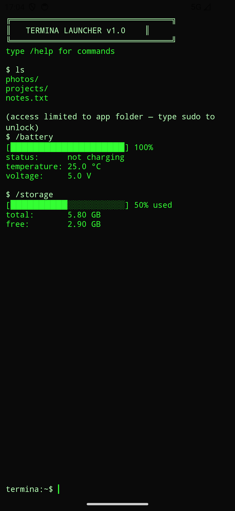
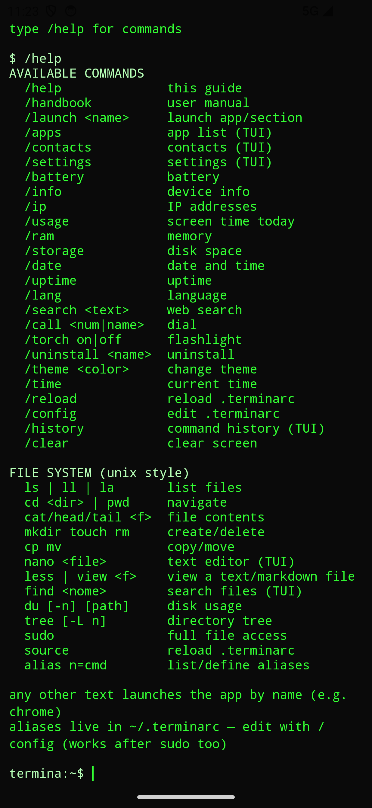
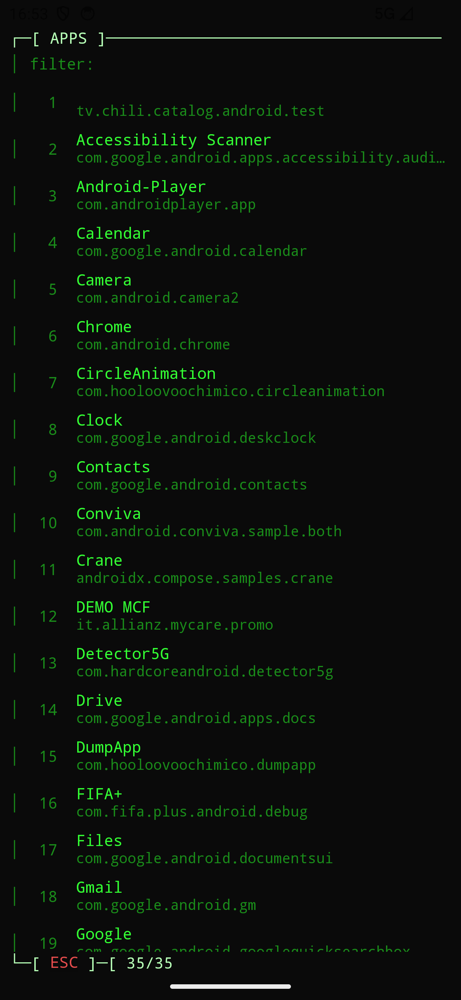
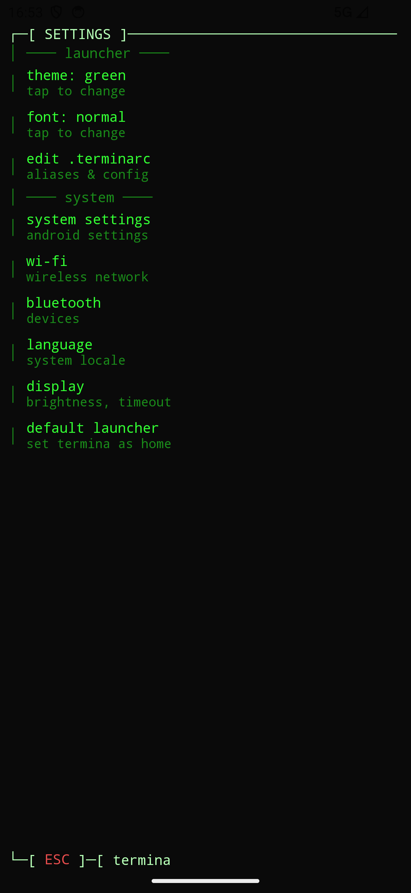
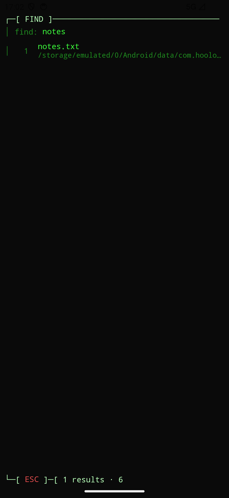
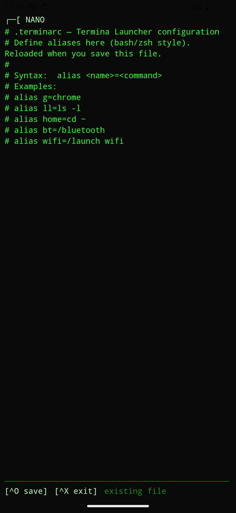
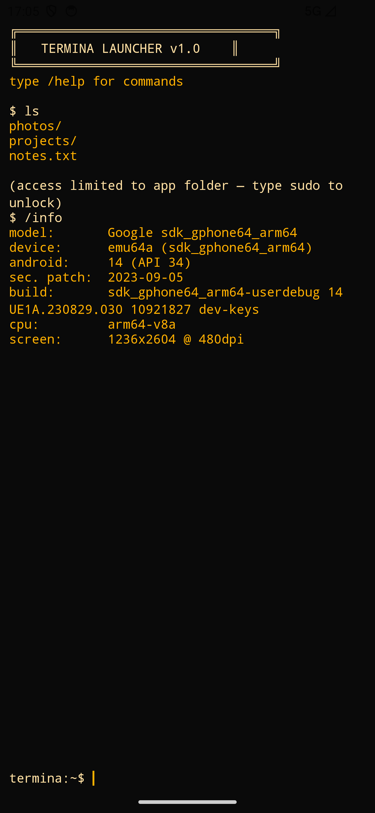

<div align="center">

# Termina Launcher

**Your phone's home screen, reimagined as a terminal.**

Stop tapping icons. Type `chrome` to open Chrome, `ls` to browse files,
`/battery` to check your charge. A distraction-free, keyboard-first Android
home screen with a retro TUI soul.

[](https://developer.android.com)
[](https://kotlinlang.org)
[](https://developer.android.com/jetpack/compose)
[](LICENSE)



</div>

---

## What is it?

Termina Launcher replaces the standard Android home screen with a **terminal
prompt**. Everything is a command:

- **Launch apps by name** — just type `chrome`, `gmail`, `maps`…
- **Browse your phone like a filesystem** — `ls`, `cd`, `cat`, `find`, `du`, `tree`…
- **Run launcher actions** — `/battery`, `/ip`, `/torch`, `/call`, `/uninstall`…
- **Customize it** — themes, font scale, and bash-style aliases in a `.terminarc` file.

No app drawer to scroll, no widgets, no clutter — just you and a blinking cursor.

## Screenshots

| Command list (`/help`) | App list (`/apps`) | Settings (`/settings`) |
|:---:|:---:|:---:|
|  |  |  |

| File search (`find`) | Config editor (`/config`) | Amber theme (`/theme`) |
|:---:|:---:|:---:|
|  |  |  |

## Features

- **Terminal home screen** — a `termina:~$` prompt with command history and a
  scrollable output buffer, rendered as a real TUI (ASCII boxes, progress bars).
- **Launch apps by name** — any free text starts the best-matching app.
- **Launcher commands** (`/`-prefixed): `/launch`, `/apps`, `/contacts`,
  `/settings`, `/battery`, `/info`, `/ip`, `/ram`, `/storage`, `/date`, `/time`,
  `/uptime`, `/lang`, `/search` (web), `/call`, `/torch`, `/uninstall`, `/theme`,
  `/clear`, `/reload`, `/config`, `/handbook`.
- **Unix-like file system** — `ls`, `cd`, `pwd`, `cat`, `head`, `tail`, `mkdir`,
  `touch`, `rm`, `cp`, `mv`, `nano`, `du`, `tree`, `find`, plus `sudo` to unlock
  full storage access.
- **Fast file search** — `find <name>` builds a background index and shows a
  live-filtered TUI; tap a result to open, navigate to, or share it.
- **`.terminarc` config** — bash-style aliases (`alias g=chrome`, `alias ll=ls -l`),
  editable any time with `/config` (also reachable from Settings).
- **Built-in manual** — `/handbook` opens an in-app markdown reader with rendered
  *preview* and raw *source* tabs.
- **Themes & font scale** — green / amber / cyan / white palettes, persisted.
- **Internationalization** — English (base) and Italian, selected automatically.
- **Smooth, never blocking** — apps, contacts and file searches load off the main
  thread with a braille spinner, so the UI never freezes.
- **Recovery gesture** — hold a finger still on screen for ~5s to fully restart the
  app, a safety net in case the keyboard or UI ever gets stuck.

## Requirements

| | |
|---|---|
| **Min Android** | 7.0 Nougat (API 24) |
| **Target / compile** | Android 16 (API 36) |
| **Language** | Kotlin 2.3 |
| **UI** | Jetpack Compose + Material 3 (Compose BOM 2026.03) |

## Build & install

```bash
# build the debug APK
./gradlew :app:assembleDebug

# install on a connected device or emulator
adb install -r app/build/outputs/apk/debug/app-debug.apk
```

The application id is `com.hooloovoochimico.terminalauncher`.

## Set Termina as your home screen

After installing, make it your default launcher:

- run `/settings` → **default launcher**, or
- press Home and pick *Termina Launcher*, or
- go to Android *Settings → Apps → Default apps → Home app*.

## Command reference

| Type | What it does | Example |
|---|---|---|
| *free text* | launch the matching app | `whatsapp` |
| `/command` | launcher / device action | `/battery`, `/torch`, `/ip` |
| `unix command` | navigate & manage files | `ls`, `cd projects`, `find todo` |
| `sudo` | request full storage access (`MANAGE_EXTERNAL_STORAGE`) | `sudo` |
| `alias name=cmd` | define a shortcut for the session | `alias g=chrome` |

Without `sudo`, the file system is rooted at the app's private folder. After
granting full storage access, `~` becomes `/storage/emulated/0` and `find`/`ls`
see your whole device.

### Example `.terminarc`

```sh
# ~/.terminarc — reloaded automatically when you save it
alias g=chrome
alias ll=ls -l
alias home=cd ~
alias bt=/bluetooth
alias wifi=/launch wifi
```

## Permissions

| Permission | Why | When |
|---|---|---|
| `READ_CONTACTS` | list & call contacts (`/contacts`, `/call`) | requested on first use |
| `MANAGE_EXTERNAL_STORAGE` | browse the whole filesystem | only when you type `sudo` |
| `REQUEST_DELETE_PACKAGES` | uninstall apps from the terminal | only when you run `/uninstall` |

All permissions are optional — the launcher is fully usable without granting any.

## Tech stack

- **Kotlin** + **Jetpack Compose** (Material 3), single-Activity.
- `TerminalViewModel` holds all state; screens are switched via a `TermScreen`
  enum (no navigation library).
- **Coroutines** for off-main-thread loading of apps, contacts and the file index.
- A hand-rolled TUI component set (`TuiComponents.kt`) and a dependency-free
  markdown renderer (`MarkdownView.kt`).

## Project structure

```
app/src/main/java/com/hooloovoochimico/terminalauncher/
├─ MainActivity.kt   # Compose host + recovery-gesture wiring
├─ terminal/         # TerminalViewModel, command models
├─ system/           # apps, contacts, file system, file index, device info
├─ ui/               # terminal, apps, contacts, settings, editor, search, manual…
└─ theme/            # palettes, typography
app/src/main/assets/ # bundled user manual (handbook.md / handbook-it.md)
```

The in-app manual lives in `app/src/main/assets/` — read it from the device with
`/handbook`.

## Localization

Strings live in `res/values/` (English, base) and `res/values-it/` (Italian);
Android picks the right one automatically. Adding a language is just a new
`values-xx/` folder (plus a `handbook-xx.md` for the manual).

## License

Copyright (C) 2026 Angelo Moroni

This program is free software: you can redistribute it and/or modify it under the
terms of the **GNU General Public License v3.0** as published by the Free Software
Foundation. This program is distributed in the hope that it will be useful, but
WITHOUT ANY WARRANTY; without even the implied warranty of MERCHANTABILITY or
FITNESS FOR A PARTICULAR PURPOSE. See the [LICENSE](LICENSE) file for the full text.
